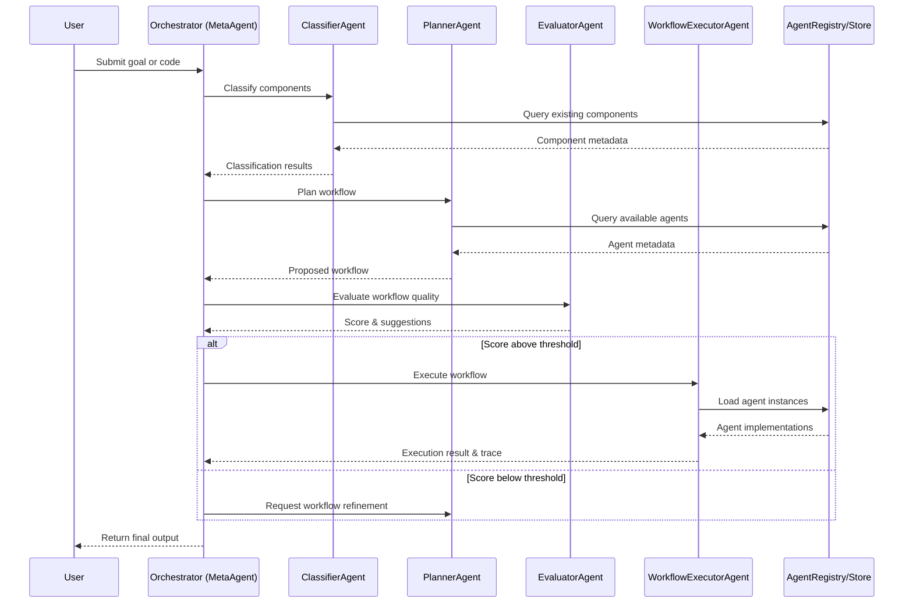

# T‑Developer Agent Squad Architecture

This document describes the architecture of cooperating agent groups ("agent squads") and the orchestrator that leads them. It clarifies how multiple agents are organized into teams or sequences to accomplish complex tasks, and how the orchestrator coordinates them.

---

## 1. Orchestrator Overview

The **Orchestrator** (also known as **MetaAgent**) serves as the central "brain" that coordinates a squad of specialized agents within the T‑Developer system. It brings together core agents—ClassifierAgent, PlannerAgent, EvaluatorAgent, and WorkflowExecutorAgent—into a unified control flow.

While each agent has its own specialized role, the orchestrator oversees the sequence, making high-level decisions such as:
- Which workflow to execute
- When to loop back for refinement
- Whether to generate new agents when needed
- How to handle errors or exceptions

The orchestrator ensures that the entire process flows smoothly from user request to final output, managing the handoffs between specialized agents.

## 2. Core Agent Roles in the Squad

### ClassifierAgent

**Role**: Analyzes new code or definitions to classify them as Tool, Agent, or Team.
**Function**: Tags components with their type and metadata (brain count, reusability tier).
**Input**: Python code files or code strings
**Output**: Classification metadata (JSON)

The ClassifierAgent acts as the "analyzer" that understands the structure and complexity of components in the system.

### PlannerAgent

**Role**: Takes a goal or request and breaks it into a proposed workflow of steps.
**Function**: Selects which agents or tools to use in what order to accomplish the goal.
**Input**: User goal (natural language or structured specification)
**Output**: Workflow definition (JSON/YAML)

The PlannerAgent is the "strategist" that designs the plan (workflow definition) for the squad.

### EvaluatorAgent (WorkflowEvaluator)

**Role**: Reviews proposed workflows or agents and scores their quality, robustness, etc.
**Function**: Ensures plans are sound before execution and suggests improvements.
**Input**: Workflow definition or agent code
**Output**: Quality score and improvement suggestions

The EvaluatorAgent is the "critic" or quality gate that validates plans and selects the best workflow among candidates.

### WorkflowExecutorAgent

**Role**: Carries out the workflow step by step, invoking each agent/tool in sequence.
**Function**: Manages the data flow between steps and handles execution context.
**Input**: Workflow definition and initial inputs
**Output**: Execution results and trace logs

The WorkflowExecutorAgent is the "action" agent that serves as the runtime engine of the squad's plan.

## 3. Team vs. Squad Clarification

It's important to distinguish between a **Team** (as defined in T-Developer's taxonomy) and an ad-hoc "agent squad" under the orchestrator:

- **Team**: A defined composite agent with multiple decision points and internal coordination logic. A Team is a single executable unit that appears as one component to the system.

- **Agent Squad**: The orchestrator-led ensemble of system agents working together to fulfill a request. The squad is not a formal entity but rather a dynamic collaboration pattern.

The key difference is that a Team is a predefined, packaged unit, while a Squad is assembled dynamically by the orchestrator. Furthermore, the orchestrator can assemble a squad that might itself include one or more predefined Teams as steps in a workflow.

## 4. Architecture Diagram

**Figure**: Sequence of interactions in the orchestrator. The Orchestrator (MetaAgent) coordinates the flow between Classifier, Planner, Evaluator, and Executor to fulfill the user's request.

**그림**: 오케스트레이터 내 상호작용 순서. 오케스트레이터(MetaAgent)는 사용자 요청을 처리하기 위해 분류기, 플래너, 평가기, 실행기 간의 흐름을 조정합니다.

## 5. Agent Communication & Data Flow

Data passes between agents in the squad through well-defined interfaces:

1. **User Request → Orchestrator**: The process begins with a user request (goal description or code) submitted to the orchestrator.

2. **Orchestrator → ClassifierAgent**: If code is provided, the orchestrator sends it to the ClassifierAgent for analysis.

3. **ClassifierAgent → AgentRegistry**: The ClassifierAgent queries the AgentRegistry to check for existing components and avoid duplicates.

4. **ClassifierAgent → Orchestrator**: Classification results are returned to the orchestrator, including component type and metadata.

5. **Orchestrator → PlannerAgent**: The orchestrator sends the goal and available components to the PlannerAgent.

6. **PlannerAgent → AgentRegistry**: The PlannerAgent queries the AgentRegistry to find suitable agents for each step.

7. **PlannerAgent → Orchestrator**: The PlannerAgent produces a workflow definition (JSON/YAML) that is sent back to the orchestrator.

8. **Orchestrator → EvaluatorAgent**: The orchestrator sends the draft workflow to the EvaluatorAgent for quality assessment.

9. **EvaluatorAgent → Orchestrator**: The EvaluatorAgent returns a quality score and suggestions for improvement.

10. **Orchestrator → WorkflowExecutorAgent**: If the workflow passes evaluation, the orchestrator sends it to the WorkflowExecutorAgent along with initial inputs.

11. **WorkflowExecutorAgent → AgentRegistry**: The executor loads agent instances from the registry to run each step.

12. **WorkflowExecutorAgent → Orchestrator**: Execution results and logs are returned to the orchestrator.

13. **Orchestrator → User**: The final results are returned to the user.

The **AgentRegistry/Store** serves as a central repository that all agents consult. It provides:
- Component metadata for classification and planning
- Agent implementations for execution
- Storage for newly created or updated agents

## 6. Error Handling & Orchestration Logic

The orchestrator implements several strategies for handling errors and suboptimal outcomes:

### Quality-Based Refinement Loop

If the EvaluatorAgent finds that a workflow's quality score is below the acceptable threshold, the orchestrator triggers the PlannerAgent to re-plan with adjustments. This creates a refinement loop:

1. PlannerAgent creates initial workflow
2. EvaluatorAgent scores it as insufficient
3. Orchestrator requests refinement with specific feedback
4. PlannerAgent creates improved workflow
5. Process repeats until quality threshold is met or maximum iterations reached

### Multiple Candidate Selection

The orchestrator may request multiple workflow candidates from the PlannerAgent and use the EvaluatorAgent to select the best one:

1. PlannerAgent generates 2-3 alternative workflows
2. EvaluatorAgent scores each workflow
3. Orchestrator selects the highest-scoring workflow for execution

### Agent Generation Trigger

If the PlannerAgent cannot find suitable agents for a required step, the orchestrator can trigger the AutoAgentComposer (agno) to generate a new agent:

1. PlannerAgent identifies missing capability
2. Orchestrator calls AutoAgentComposer
3. New agent is created and registered
4. PlannerAgent incorporates new agent into workflow

### Execution Error Recovery

If the WorkflowExecutorAgent encounters an error during execution, the orchestrator can:
- Retry the failed step with different parameters
- Fall back to an alternative workflow
- Request human intervention if available
- Return a partial result with explanation

## 7. Scope and Extensibility

The agent squad architecture is designed for extensibility in several ways:

### Additional Squad Members

The core squad can be extended with additional specialized agents:
- **TestRunnerAgent**: For validating agents and workflows
- **AutoAgentComposer**: For generating new agents on demand
- **AgentVersionManager**: For managing agent versions and rollbacks
- **SlackNotifierAgent**: For external notifications and alerts

### Customizable Orchestration

The MetaAgent's orchestration logic can be customized for different use cases:
- Different evaluation criteria for different domains
- Custom planning strategies for specific types of workflows
- Domain-specific classification rules

### Chained MetaAgents

Multiple MetaAgents can be chained together for complex processes:
- One MetaAgent for development and testing
- Another for deployment and monitoring
- A third for user interaction and feedback

### External Integration

The orchestrator can integrate with external systems:
- CI/CD pipelines for automated testing and deployment
- Human-in-the-loop interfaces for approval or guidance
- Monitoring and logging systems for observability

---

## 에이전트 스쿼드 아키텍처 요약 (Korean Summary)

T‑Developer의 에이전트 스쿼드 아키텍처는 오케스트레이터(MetaAgent)가 여러 전문 에이전트를 조정하여 복잡한 작업을 수행하는 구조입니다. 핵심 에이전트로는 코드를 분석하는 ClassifierAgent, 워크플로우를 설계하는 PlannerAgent, 품질을 평가하는 EvaluatorAgent, 실행을 담당하는 WorkflowExecutorAgent가 있습니다.

이 아키텍처에서 "팀(Team)"과 "스쿼드(Squad)"는 구분됩니다. 팀은 미리 정의된 복합 에이전트로 단일 실행 단위로 작동하는 반면, 스쿼드는 오케스트레이터가 동적으로 구성하는 협업 패턴입니다.

오케스트레이터는 품질 기반 개선 루프, 다중 후보 선택, 에이전트 생성 트리거, 실행 오류 복구 등의 전략을 통해 오류와 최적화되지 않은 결과를 처리합니다. 이 아키텍처는 추가 스쿼드 멤버, 맞춤형 오케스트레이션, 연결된 MetaAgent, 외부 통합 등을 통해 확장성을 제공합니다.