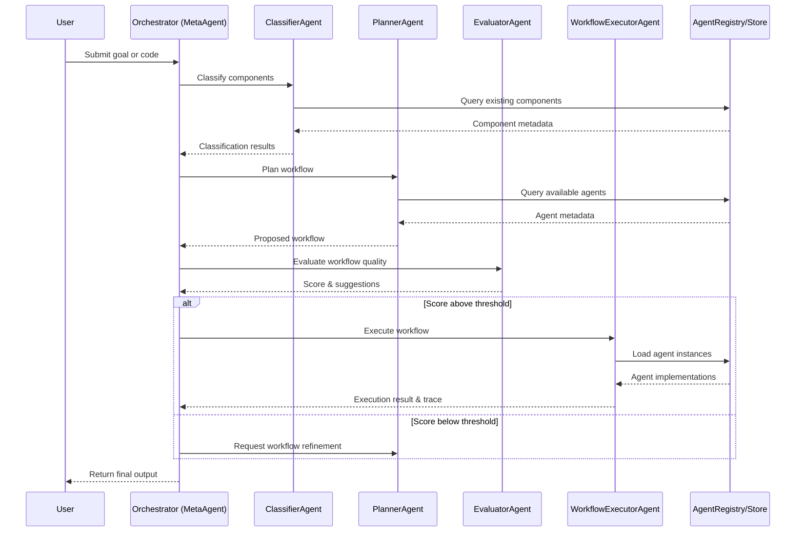
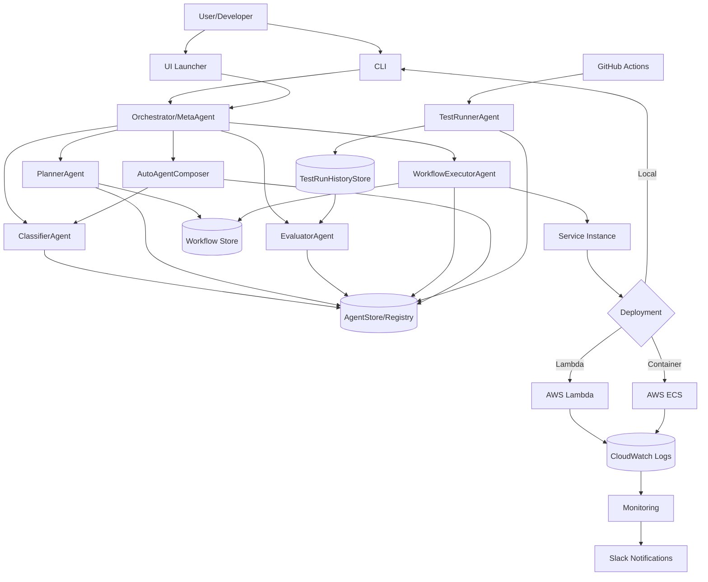
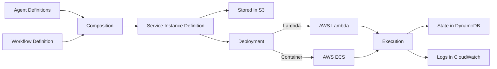
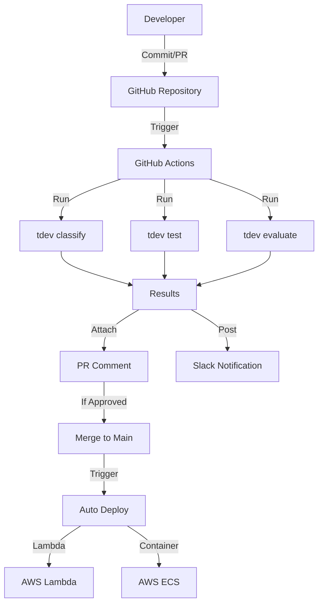

# T‑Developer Architecture Diagrams

This document provides visual aids to illustrate the dynamic behavior and data flows within the T‑Developer system. These diagrams help clarify how data and control move through the system's components.

---

## 1. System Sequence Diagram (Orchestrator Flow)

The following sequence diagram depicts the step-by-step interaction in the orchestrator pipeline:

**Figure 1**: Sequence of interactions in the orchestrator. The Orchestrator (MetaAgent) coordinates the flow between Classifier, Planner, Evaluator, and Executor to fulfill the user's request.

**그림 1**: 오케스트레이터 내 상호작용 순서. 오케스트레이터(MetaAgent)는 사용자 요청을 처리하기 위해 분류기, 플래너, 평가기, 실행기 간의 흐름을 조정합니다.

### Alternative Text Description

1. User submits a goal or code to the Orchestrator (MetaAgent)
2. Orchestrator sends code to ClassifierAgent for analysis
3. ClassifierAgent queries AgentRegistry for existing components
4. AgentRegistry returns component metadata to ClassifierAgent
5. ClassifierAgent returns classification results to Orchestrator
6. Orchestrator sends goal and available components to PlannerAgent
7. PlannerAgent queries AgentRegistry for available agents
8. AgentRegistry returns agent metadata to PlannerAgent
9. PlannerAgent returns proposed workflow to Orchestrator
10. Orchestrator sends workflow to EvaluatorAgent for quality assessment
11. EvaluatorAgent returns score and suggestions to Orchestrator
12. If score is above threshold:
    - Orchestrator sends workflow to WorkflowExecutorAgent
    - WorkflowExecutorAgent loads agent instances from AgentRegistry
    - AgentRegistry returns agent implementations
    - WorkflowExecutorAgent returns execution results to Orchestrator
13. If score is below threshold:
    - Orchestrator requests workflow refinement from PlannerAgent
14. Orchestrator returns final output to User

## 2. Data Flow Diagram (Component Interaction)

The following diagram shows the static architecture components and data stores, and how data flows among them:

**Figure 2**: Data flow between T‑Developer components. Arrows represent data or control flow between components.

**그림 2**: T‑Developer 구성 요소 간의 데이터 흐름. 화살표는 구성 요소 간의 데이터 또는 제어 흐름을 나타냅니다.

### Alternative Text Description

- **User Interaction**: Users interact with the system through CLI or UI Launcher
- **Orchestration**: The Orchestrator/MetaAgent coordinates ClassifierAgent, PlannerAgent, EvaluatorAgent, WorkflowExecutorAgent, and AutoAgentComposer
- **Data Stores**: The system uses AgentStore/Registry, Workflow Store, TestHistoryStore, and CloudWatch Logs
- **Agent Generation**: AutoAgentComposer creates new agents and sends them to ClassifierAgent for classification
- **Deployment**: Service Instances are deployed to AWS Lambda, AWS ECS, or locally via CLI
- **Monitoring**: Logs are collected in CloudWatch and notifications are sent to Slack
- **Testing**: GitHub Actions triggers TestRunnerAgent, which stores results in TestHistoryStore

## 3. Service Instance Deployment Flow

This diagram illustrates how a composed service is deployed and executed:

**Figure 3**: Service instance deployment and execution flow. Agent and workflow definitions are composed into a service instance, which is then deployed and executed.

**그림 3**: 서비스 인스턴스 배포 및 실행 흐름. 에이전트 및 워크플로우 정의는 서비스 인스턴스로 구성되어 배포 및 실행됩니다.

### Alternative Text Description

1. Agent Definitions and Workflow Definition are inputs to the Composition process
2. Composition creates a Service Instance Definition
3. The Service Instance Definition is stored in S3
4. The Service Instance Definition is deployed to AWS Lambda or AWS ECS
5. The deployed service is executed
6. Execution state is stored in DynamoDB
7. Execution logs are stored in CloudWatch

## 4. DevSecOps Integration Flow

This diagram shows how T‑Developer integrates with DevSecOps pipelines:

**Figure 4**: DevSecOps integration flow. Code changes trigger automated classification, testing, and evaluation, with results posted to PR comments and Slack.

**그림 4**: DevSecOps 통합 흐름. 코드 변경은 자동 분류, 테스트 및 평가를 트리거하며, 결과는 PR 댓글과 Slack에 게시됩니다.

### Alternative Text Description

1. Developer commits code or opens a PR in GitHub Repository
2. GitHub Actions is triggered
3. Actions runs `tdev classify`, `tdev test`, and `tdev evaluate`
4. Results are collected
5. Results are attached to PR Comment and posted to Slack Notification
6. If PR is approved, it is merged to Main
7. Merge triggers Auto Deploy
8. Service is deployed to AWS Lambda or AWS ECS

---

## 아키텍처 다이어그램 요약 (Korean Summary)

이 문서는 T‑Developer 시스템 내의 동적 동작과 데이터 흐름을 설명하는 시각적 보조 자료를 제공합니다.

**시스템 시퀀스 다이어그램**은 오케스트레이터 파이프라인의 단계별 상호작용을 보여줍니다. 사용자가 목표나 코드를 제출하면 오케스트레이터가 분류기, 플래너, 평가기, 실행기 간의 흐름을 조정하여 요청을 처리합니다.

**데이터 흐름 다이어그램**은 정적 아키텍처 구성 요소와 데이터 저장소, 그리고 그들 간의 데이터 흐름을 보여줍니다. 사용자는 CLI나 UI 런처를 통해 시스템과 상호작용하고, 오케스트레이터는 여러 에이전트를 조정하며, 시스템은 다양한 데이터 저장소를 사용합니다.

**서비스 인스턴스 배포 흐름**은 구성된 서비스가 어떻게 배포되고 실행되는지 보여줍니다. 에이전트 및 워크플로우 정의는 서비스 인스턴스로 구성되어 AWS Lambda나 ECS에 배포되고 실행됩니다.

**DevSecOps 통합 흐름**은 T‑Developer가 DevSecOps 파이프라인과 어떻게 통합되는지 보여줍니다. 코드 변경은 자동 분류, 테스트, 평가를 트리거하고, 결과는 PR 댓글과 Slack에 게시됩니다.