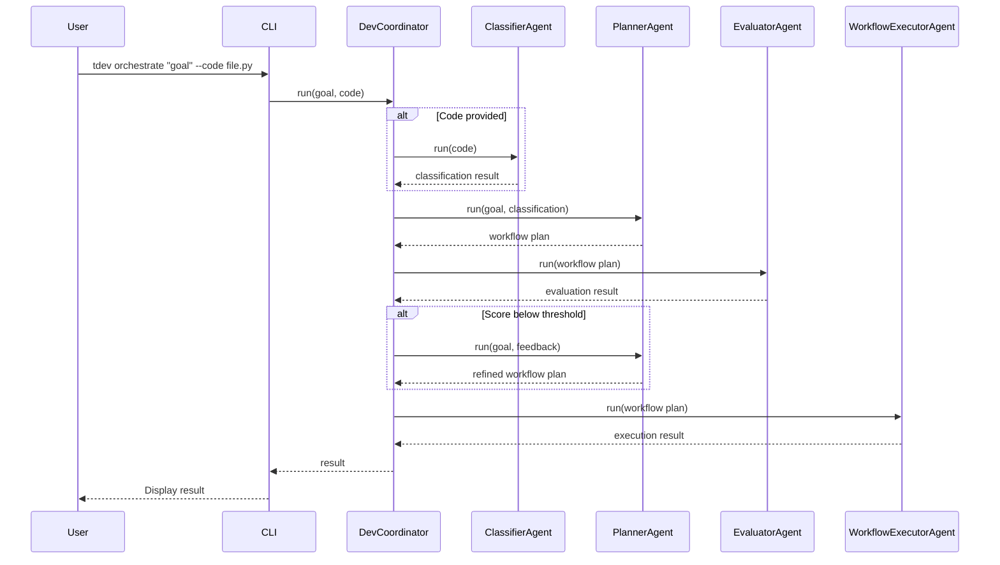

# T-Developer Execution Flow

This document provides a detailed, step-by-step breakdown of the execution flow in T-Developer using the Agent Squad framework.

## Overview

The execution flow in T-Developer follows a structured sequence from user input to result, coordinated by the Agent Squad orchestrator (DevCoordinator). This document describes each step in detail.

## Execution Sequence

### 1. User Input

A user invokes the CLI (or API) with a goal and optionally a code snippet or file path and options:

```bash
tdev orchestrate "Create a function to calculate Fibonacci numbers" --code path/to/code.py
```

The CLI parses these inputs and prepares them for the orchestrator.

### 2. Agent Squad Orchestrator Activation

The input is passed to the Agent Squad orchestrator (the SupervisorAgent/DevCoordinator). The orchestrator is responsible for coordinating the entire process.

If a code file is included, the orchestrator first utilizes the ClassifierAgent to determine what the file represents (tool/agent/team). This classification is done automatically by the orchestrator's logic.

```python
# Inside DevCoordinatorAgent
if code:
    classifier = registry.get_instance("ClassifierAgent")
    classification_result = classifier.run(code)
```

### 3. Planning

The orchestrator (via the lead agent or coordinator logic) invokes the PlannerAgent with the user's goal and classification result (if any):

```python
planner = registry.get_instance("PlannerAgent")
workflow_plan = planner.run({
    "goal": goal,
    "classification": classification_result
})
```

The PlannerAgent returns a proposed **workflow plan** in the form of a JSON with a list of steps:

```json
{
  "id": "fibonacci-function-v1",
  "steps": [
    {
      "id": "analyze",
      "agent": "CodeAnalyzerAgent",
      "input_from": "code",
      "output_to": "analysis"
    },
    {
      "id": "implement",
      "agent": "CodeGeneratorAgent",
      "input_from": "analysis",
      "output_to": "implementation"
    }
  ]
}
```

This plan outlines how to fulfill the goal, typically listing which agents or tools to call in sequence.

### 4. Evaluation & Refinement

The orchestrator next calls the EvaluatorAgent to assess the proposed plan:

```python
evaluator = registry.get_instance("EvaluatorAgent")
evaluation = evaluator.run(workflow_plan)
```

The EvaluatorAgent produces a score and feedback:

```json
{
  "score": 0.85,
  "feedback": [
    "The plan covers the basic requirements",
    "Consider adding a testing step"
  ]
}
```

If the plan is suboptimal (score below threshold), the orchestrator will trigger a refinement cycle:

```python
if evaluation["score"] < 0.7:  # Threshold for acceptance
    # Request refinement from the planner
    planning_input["feedback"] = evaluation["feedback"]
    workflow_plan = planner.run(planning_input)
```

This loop (Planner -> Evaluator) may repeat until an acceptable plan is obtained or a maximum iteration is reached.

### 5. Execution

Once the plan is finalized, the orchestrator invokes the WorkflowExecutorAgent to carry out the plan steps:

```python
executor = registry.get_instance("WorkflowExecutorAgent")
execution_result = executor.run(workflow_plan)
```

The WorkflowExecutorAgent executes each step in the plan in order, utilizing either direct agent calls or Agent Squad's messaging. For example:

```python
# Inside WorkflowExecutorAgent
for step in workflow_plan["steps"]:
    agent_name = step["agent"]
    agent = registry.get_instance(agent_name)
    input_data = context[step["input_from"]]
    result = agent.run(input_data)
    context[step["output_to"]] = result
```

If any step fails or produces new information, the executor handles it according to the plan's error handling instructions (for now, it typically continues or stops on error).

### 6. Result Aggregation

After execution, the final result (for example, a completed code artifact, or a summary of actions) is returned by the WorkflowExecutorAgent:

```json
{
  "result": "def fibonacci(n):\n    if n <= 1:\n        return n\n    else:\n        return fibonacci(n-1) + fibonacci(n-2)",
  "steps_executed": 2,
  "execution_time": 1.5
}
```

The orchestrator collects this and presents it as the outcome. If using SupervisorAgent with an LLM lead, the lead agent might formulate the final answer to the user based on all the context. Otherwise, the DevCoordinator simply outputs the WorkflowExecutor's result.

The result is printed to the console by the CLI:

```
Orchestration completed.
Result: {
  "result": "def fibonacci(n):\n    if n <= 1:\n        return n\n    else:\n        return fibonacci(n-1) + fibonacci(n-2)",
  "steps_executed": 2,
  "execution_time": 1.5
}
```

### 7. Context Handling

Agent Squad's context management system maintains conversation state for multi-turn interactions. While T-Developer doesn't currently support interactive conversations, the architecture is ready for iterative dialogues.

Agent Squad can maintain:
- **User-Supervisor memory**: Remembers the conversation history between the user and the supervisor
- **Supervisor-Team memory**: Maintains context between the supervisor and its team members

This enables more complex, stateful interactions in future versions.

## Sequence Diagram



This diagram illustrates the flow of a request through the system, showing how the DevCoordinator orchestrates the core agents to fulfill the user's goal.